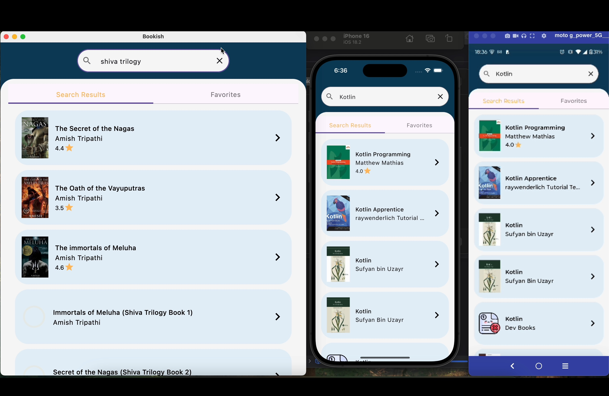

# Bookish - the CMP app

This is a Kotlin Multiplatform project targeting Android, iOS, Desktop.
It is a book search app using the open API from https://openlibrary.org
You can search for the books and add them to your favorites.

## Project Overview
* Language: Kotlin
* Framework: Android SDK & Compose Multiplatform
* Build System: Gradle
* Version Control: Git
* Dependency Injection: Koin
* Local Database: Room
* Architecture: MVI (Model-View-Intent)

## App Screenshots

  

## CMP

* `/composeApp` is for code that will be shared across your Compose Multiplatform applications.
  It contains several subfolders:
  - `commonMain` is for code that’s common for all targets.
  - Other folders are for Kotlin code that will be compiled for only the platform indicated in the folder name.
    For example, if you want to use Apple’s CoreCrypto for the iOS part of your Kotlin app,
    `iosMain` would be the right folder for such calls.

* `/iosApp` contains iOS applications. Even if you’re sharing your UI with Compose Multiplatform, 
  you need this entry point for your iOS app. This is also where you should add SwiftUI code for your project.
